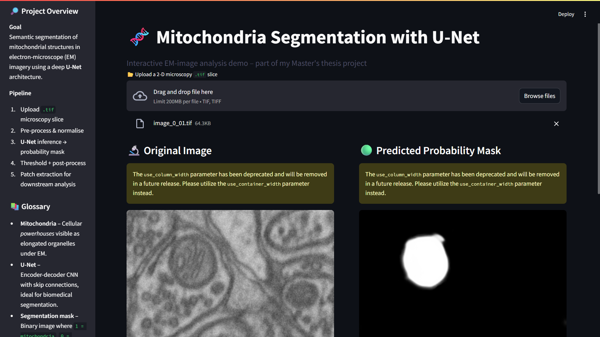

# 🧬 Mito-Segmentation

A deep learning project for **automatic mitochondria segmentation** in grayscale microscopy images using a U-Net architecture. Includes a **Streamlit UI demo** for real-time image upload and segmentation.


---

## 📸 Demo




> **Demo UI:** Upload `.tif` microscopy images and receive the segmented output mask in real time.

---

## 📂 Project Overview

This repository contains:

- ✅ A trained U-Net model for mitochondria segmentation  
- ✅ Code to process `.tif` microscopy images and masks  
- ✅ A `Streamlit`-based UI (`streamlit_app.py`)  
- ✅ Patch extraction and visualization utilities  

---

## 🚀 Quick Start

### 🔧 1. Clone the Repository

```bash
git clone https://github.com/harshitatemare236005/Mito-Segmentation.git
cd Mito-Segmentation
